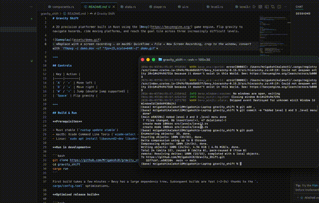

# Gravity Shift

A 2D precision platformer built in Rust using the [Bevy](https://bevyengine.org/) game engine. Flip gravity to navigate hazards, ride moving platforms, and reach the goal tile across three increasingly difficult levels.



---

## Controls

| Key | Action |
|-----|--------|
| `A` / `←` | Move left |
| `D` / `→` | Move right |
| `W` / `↑` | Jump (double jump supported) |
| `Space` | Flip gravity |

---

## Build & Run

**Prerequisites**

- Rust stable (`rustup update stable`)
- macOS: Xcode Command Line Tools (`xcode-select --install`)
- Linux: `sudo apt install libasound2-dev libudev-dev` (audio + input)

**Run in development**

```bash
git clone https://github.com/MrigakshiK/gravity_shift
cd gravity_shift
cargo run
```

First build takes a few minutes — Bevy has a large dependency tree. Subsequent builds are fast (~2–3s) thanks to the `.cargo/config.toml` optimisations.

**Optimised release build**

```bash
cargo build --release
./target/release/gravity_shift
```

---

## Architecture

### Why Bevy ECS?

Bevy uses an **Entity Component System** — instead of objects with methods, you have:

- **Entities** — just IDs (the player, a platform, a hazard)
- **Components** — plain data structs attached to entities (`RigidBody`, `JumpCount`, `MovingPlatform`)
- **Systems** — functions that query for entities with specific components and act on them

This maps surprisingly well to Rust's ownership model. No shared mutable state, no inheritance hierarchies — systems either get exclusive mutable access to a component or they don't compile.

### Project Structure

```
src/
├── main.rs          # App setup, plugin registration, state transitions
├── components.rs    # All component and resource definitions
├── state.rs         # GameState FSM (MainMenu → LevelSelect → Playing → LevelComplete → GameOver)
├── player.rs        # Player spawn, movement, jump, gravity flip, collision death
├── ui.rs            # All Bevy UI — menus, HUD, screens
├── systems.rs       # Generic cleanup system (despawns entities by marker component)
└── levels/
    ├── mod.rs       # Level trait + spawn_platform / spawn_hazard / spawn_goal helpers
    ├── level1.rs    # Tutorial layout
    ├── level2.rs    # Precision + moving platforms
    └── level3.rs    # Gravity flip required to complete
```

### Key Design Decisions

**State machine as first-class citizen**

`GameState` is a Bevy `States` enum. Every system is gated with `.run_if(in_state(...))` — gameplay systems only run during `Playing`, menu input only during `MainMenu`. Transitions are explicit (`NextState<GameState>`), making the flow easy to reason about and extend.

```rust
#[derive(States, Default)]
enum GameState {
    #[default] MainMenu,
    LevelSelect,
    Playing,
    LevelComplete,
    GameOver,
}
```

**Level as a Rust trait**

Each level implements a single `Level` trait with one method. New levels are one file and one `match` arm — no central registry to update, no config files.

```rust
pub trait Level {
    fn spawn(&self, commands: &mut Commands);
}
```

**Cleanup via marker components**

Rather than tracking spawned entities manually, every level entity gets a `LevelEntity` marker. On `OnExit(Playing)`, a single generic system despawns everything tagged with it. Same pattern for `MenuItem`, `GameOverItem`, etc.

```rust
fn cleanup<T: Component>(mut commands: Commands, query: Query<Entity, With<T>>) {
    for entity in &query { commands.entity(entity).despawn_recursive(); }
}
```

**Physics separation from visuals**

Player physics (`RigidBody`, `Collider`, `LinearVelocity`) live on the entity that avian2d owns. avian2d writes to `Transform` every physics step — so visual-only changes (rotation, colour) go on child entities to avoid the engine overwriting them.

**Moving platforms via velocity, not transform**

Kinematic platforms set `LinearVelocity` each frame rather than directly mutating `Transform`. This lets avian2d resolve contacts during the same physics step, so the player is correctly carried along instead of sliding off.

---

## Dependencies

| Crate | Purpose |
|-------|---------|
| `bevy` | Game engine — ECS, rendering, input, UI, audio |
| `avian2d` | 2D physics — rigid bodies, colliders, sensors, shape casting |
